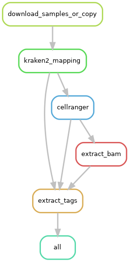

# sc-Virome-Scan: A Snakemake pipeline for detection of viruses in single-cell datasets.

A method wrapped around Snakemake for swift, precise, and accurate detection of viral pathogens in single-cell
RNA (scRNA) datasets to investigate the possible correlation between viral pathogens and neurodegenerative diseases. 

  

# DAG for the pipeline

  

## Usage

> ***snakemake --cores 16 --use-conda --configfile config.yaml --latency-wait 60***
    
### Note
This is a developmental and alpha phase of the pipeline, upon completion a Python Wrapper will take care of every runtime parameter handling automatically.

  

## Contributing
The usage of this workflow is described in the [Snakemake Workflow Catalog](https://snakemake.github.io/snakemake-workflow-catalog/?usage=maxplanck-ie%2Fsc-virome-scan).

If you use this workflow in a paper, don't forget to give credits to the authors by citing the URL of this (original) repository and its DOI (see above).

