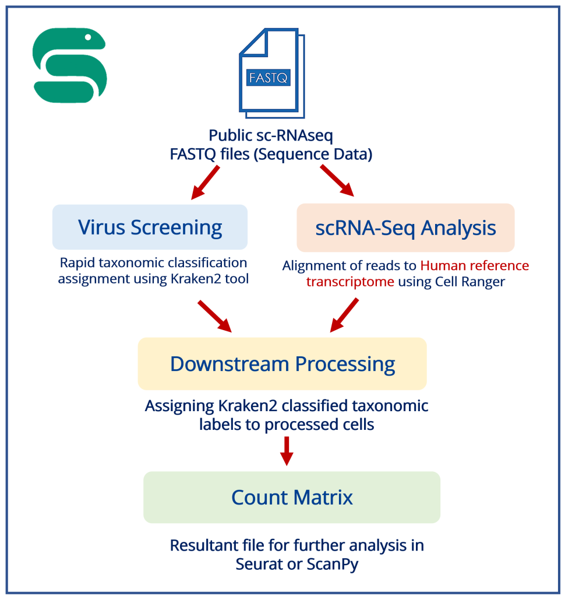

: _method:

Method
===========

The sc-VirusScan method consists of two major modules:

* **A virus screening module**
* **sc-RNAseq analysis module**

The results from both modules are integrated and allow detection and classification of viral pathogens in single-cell
RNA datasets. 

The virus screening module utilizes the Kraken2 tool for swift taxonomic classification of input sequences, enabling rapid identification and
classification of viral sequences.

The sc-RNAseq analysis module processes single-cell RNA data by internally executing a sequence of
steps using Cell Ranger.

The results obtained from both modules are integrated to produce a count matrix.

